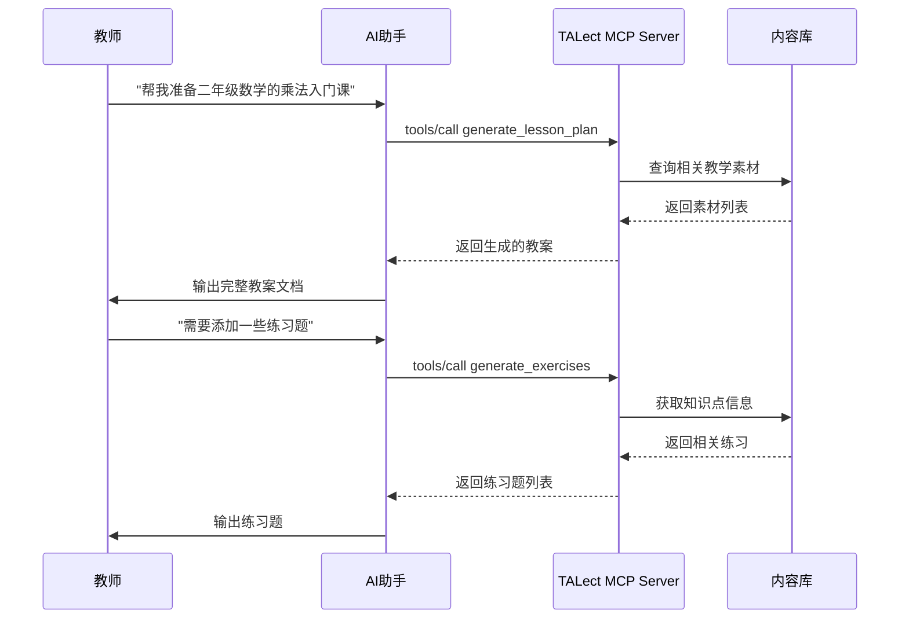

# AI助教/智能备课应用场景

## 🎯 场景概述

教师使用自然语言指令，让AI生成个性化教案、课件内容、随堂练习题，实现智能备课。

## 📋 具体应用方式

### 典型使用场景
- **新教师快速上手**: "帮我准备一年级数学的加法入门课"
- **个性化教学设计**: "为学困生设计分数运算的补习教案"
- **跨学科整合**: "结合历史和语文，设计一个关于古代诗词的综合课"
- **临时调整**: "原计划的物理实验课临时取消，帮我准备一个理论课的替代方案"

## 🛠️ TALect MCP技术实现

### 核心工具调用流程



### 关键API调用

#### 1. 智能教案生成
```json
{
  "method": "tools/call",
  "params": {
    "name": "generate_lesson_plan",
    "arguments": {
      "material_ids": ["material-uuid-1", "material-uuid-2"],
      "objectives": ["掌握乘法基本概念", "能够进行简单乘法计算"],
      "grade": "grade_2",
      "student_level": "intermediate",
      "duration": 45,
      "teaching_style": "interactive"
    }
  }
}
```

#### 2. 教学素材搜索
```json
{
  "method": "tools/call",
  "params": {
    "name": "search_teaching_materials",
    "arguments": {
      "query": "乘法入门",
      "grade": ["grade_2"],
      "subject": "math",
      "type": "video",
      "limit": 10
    }
  }
}
```

#### 3. 智能练习生成
```json
{
  "method": "tools/call",
  "params": {
    "name": "generate_exercises",
    "arguments": {
      "material_id": "material-uuid",
      "exercise_type": "practice",
      "difficulty": "easy",
      "knowledge_points": ["乘法基础", "乘法口诀"],
      "count": 15
    }
  }
}
```

## 📊 预期效果与价值

### 效率提升
- **备课时间减少70%**: 从平均2-3小时缩短到30分钟
- **内容质量提升**: 基于学而思教研标准，确保教学一致性
- **个性化定制**: 根据学生水平和教学目标智能调整

### 质量保障
- **标准化输出**: 遵循统一的教学标准和流程
- **内容准确性**: 基于权威教育内容库
- **教学效果**: 结合大数据分析的教学策略

### 创新赋能
- **新教师成长**: 降低入门门槛，快速提升教学能力
- **教学研究**: 支持教学方法的创新和实验
- **资源共享**: 优秀教案的沉淀和复用

## 🔧 技术实现要点

### 1. 自然语言理解
- 支持模糊查询和语义理解
- 自动识别年级、学科、教学目标等关键信息
- 上下文关联和对话连续性

### 2. 内容智能匹配
- 基于向量搜索的语义匹配
- 考虑学生水平和教学进度的内容推荐
- 多维度筛选（难度、类型、时长等）

### 3. 教案生成算法
- 基于5E教学模型的结构化生成
- 结合教学经验数据的个性化调整
- 支持多种教学风格和策略

### 4. 质量控制机制
- 内容合规性检查
- 教学目标对齐度验证
- 生成结果的人工审核接口

## 🎯 实施建议

### 第一阶段：核心功能
1. 实现基础教案生成
2. 支持常用学科和年级
3. 建立内容质量评估机制

### 第二阶段：智能化提升
1. 加入用户偏好学习
2. 支持教学反馈收集
3. 实现教案迭代优化

### 第三阶段：生态建设
1. 开放教师定制接口
2. 建立优秀教案分享社区
3. 支持第三方教学资源接入

## 📈 成功指标

- **用户覆盖率**: 首年覆盖30%一线教师
- **使用频率**: 平均每周使用3-5次
- **满意度**: 用户满意度超过85%
- **教学效果**: 学生学习成绩提升5-10%
