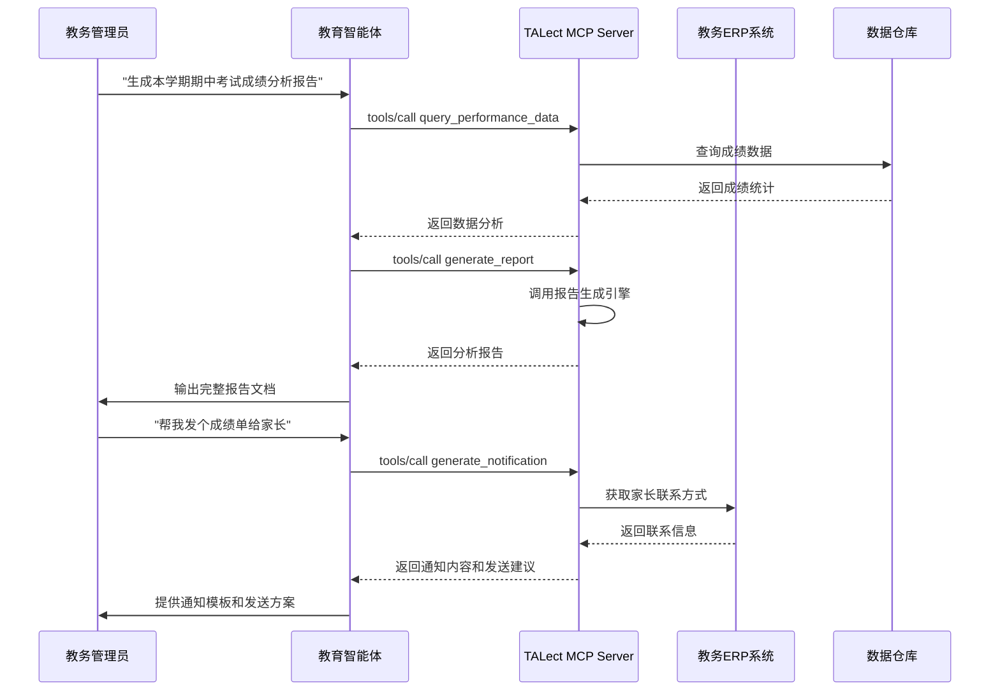

# 教育智能体与行政自动化应用场景

## 🎯 场景概述

教务管理人员通过自然语言对话，让AI完成排课优化、通知撰写、数据统计、报告生成等行政工作，实现教育机构的智能运营。

## 📋 具体应用方式

### 典型使用场景
- **智能排课**: "帮我优化下周的课程表，平衡教师 workload"
- **通知撰写**: "给三年级家长发个关于期中考试的通知"
- **数据查询**: "统计一下本月各科目的平均分和及格率"
- **报告生成**: "生成本学期的教学质量分析报告"

## 🛠️ TALect MCP技术实现

### 核心工具调用流程



### 关键API调用

#### 1. 数据查询与分析
```json
{
  "method": "tools/call",
  "params": {
    "name": "query_educational_data",
    "arguments": {
      "data_type": "performance",
      "filters": {
        "grade": "grade_2",
        "subject": "math",
        "time_range": "2024-01-01 to 2024-01-31",
        "group_by": "class"
      },
      "metrics": [
        "average_score",
        "pass_rate",
        "score_distribution",
        "improvement_trend"
      ]
    }
  }
}
```

#### 2. 智能排课优化
```json
{
  "method": "tools/call",
  "params": {
    "name": "optimize_schedule",
    "arguments": {
      "constraints": {
        "teacher_availability": ["teacher-001", "teacher-002"],
        "classroom_capacity": {"room-101": 45, "room-102": 35},
        "subject_requirements": {"math": 5, "chinese": 4},
        "time_slots": ["08:00-09:30", "10:00-11:30"]
      },
      "optimization_goals": [
        "balance_teacher_workload",
        "minimize_room_changes",
        "maximize_student_satisfaction"
      ]
    }
  }
}
```

#### 3. 通知内容生成
```json
{
  "method": "tools/call",
  "params": {
    "name": "generate_notification",
    "arguments": {
      "notification_type": "exam_results",
      "target_audience": "parents",
      "grade": "grade_2",
      "key_information": {
        "exam_name": "期中考试",
        "exam_date": "2024-01-15",
        "result_summary": "平均分85.6，及格率92%",
        "important_dates": ["家长会: 2024-01-20"]
      },
      "tone": "professional",
      "language": "zh-CN"
    }
  }
}
```

#### 4. 报告自动生成
```json
{
  "method": "tools/call",
  "params": {
    "name": "generate_administrative_report",
    "arguments": {
      "report_type": "semester_summary",
      "time_period": "2024-Spring",
      "sections": [
        "academic_performance",
        "attendance_statistics",
        "facility_utilization",
        "teacher_workload",
        "student_feedback"
      ],
      "format": "comprehensive",
      "include_recommendations": true
    }
  }
}
```

## 📊 预期效果与价值

### 运营效率提升
- **处理速度**: 复杂查询从小时级缩短到分钟级
- **准确性提升**: 减少人工错误和遗漏
- **标准化输出**: 统一的报告格式和通知模板

### 决策质量改善
- **数据驱动**: 基于完整数据的决策支持
- **预测能力**: 趋势分析和预测性洞察
- **综合视角**: 多维度数据的综合分析

### 服务体验优化
- **响应速度**: 24/7快速响应查询
- **个性化服务**: 针对不同角色的定制化信息
- **沟通效率**: 清晰准确的通知和报告

## 🔧 技术实现要点

### 1. 多系统集成能力
- **API封装**: 将现有ERP、CRM等系统的API封装为MCP工具
- **数据同步**: 实时或准实时的数据同步机制
- **权限映射**: 统一的权限控制和访问管理

### 2. 自然语言处理
- **意图识别**: 准确理解用户的查询意图
- **上下文理解**: 维护对话上下文和业务逻辑
- **多语言支持**: 支持中英文等多种语言

### 3. 智能分析引擎
- **统计建模**: 基于教育数据的统计分析模型
- **趋势预测**: 时间序列分析和预测算法
- **异常检测**: 自动识别异常数据和趋势

### 4. 内容生成系统
- **模板引擎**: 灵活的通知和报告模板系统
- **个性化定制**: 基于受众特征的内容调整
- **质量控制**: 生成内容的合规性和准确性检查

## 🎯 实施建议

### 第一阶段：基础查询
1. 实现常见数据的查询功能
2. 建立基本的通知生成能力
3. 集成主要业务系统的API

### 第二阶段：智能分析
1. 加入数据分析和趋势预测
2. 实现智能排课和资源优化
3. 支持复杂报告的自动生成

### 第三阶段：自主运营
1. 实现事件驱动的自动通知
2. 支持预测性维护和预警
3. 建立完整的运营决策支持系统

## 📈 成功指标

- **查询响应时间**: 平均响应时间小于5秒
- **任务处理效率**: 行政任务处理时间减少60%
- **用户满意度**: 内部用户满意度超过90%
- **数据准确性**: 查询结果准确率99.5%以上
- **系统可用性**: 99.9%的正常运行时间
