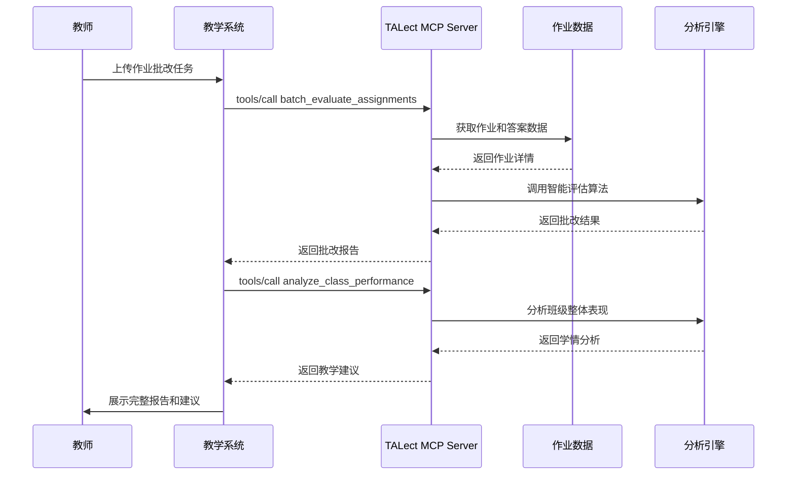

# 智能作业与学情分析应用场景

## 🎯 场景概述

系统自动批改作业、生成个性化学习报告，分析班级整体学习情况，并提供精准的教学改进建议。

## 📋 具体应用方式

### 典型使用场景
- **自动批改**: 客观题自动评分，主观题智能分析
- **学情报告**: 生成学生个体和班级整体分析报告
- **薄弱环节识别**: 自动发现班级共性问题和知识盲点
- **教学建议**: 基于数据分析提供精准教学策略

## 🛠️ TALect MCP技术实现

### 核心工具调用流程



### 关键API调用

#### 1. 作业智能批改
```json
{
  "method": "tools/call",
  "params": {
    "name": "evaluate_assignment",
    "arguments": {
      "assignment_id": "assignment-uuid",
      "student_answers": [
        {"question_id": "q1", "answer": "42", "type": "objective"},
        {"question_id": "q2", "answer": "详细解答...", "type": "subjective"}
      ],
      "evaluation_criteria": {
        "accuracy_weight": 0.7,
        "logic_weight": 0.2,
        "presentation_weight": 0.1
      }
    }
  }
}
```

#### 2. 学情数据分析
```json
{
  "method": "tools/call",
  "params": {
    "name": "analyze_class_performance",
    "arguments": {
      "class_id": "class-2024-001",
      "subject": "math",
      "time_range": {
        "start": "2024-01-01",
        "end": "2024-01-31"
      },
      "analysis_dimensions": [
        "knowledge_points",
        "difficulty_levels",
        "question_types",
        "student_groups"
      ]
    }
  }
}
```

#### 3. 教学效果评估
```json
{
  "method": "tools/call",
  "params": {
    "name": "evaluate_teaching_effectiveness",
    "arguments": {
      "material_id": "lesson-uuid",
      "usage_data": {
        "student_count": 45,
        "completion_rate": 0.92,
        "average_score": 85.6,
        "time_spent": 2400
      },
      "feedback_data": {
        "satisfaction_rating": 4.2,
        "difficulty_rating": 3.1,
        "comments": ["内容很实用", "节奏稍快"]
      }
    }
  }
}
```

#### 4. 个性化辅导建议
```json
{
  "method": "tools/call",
  "params": {
    "name": "generate_intervention_plan",
    "arguments": {
      "student_id": "student-123",
      "weak_areas": ["fraction_operations", "word_problems"],
      "current_level": "intermediate",
      "available_time": 30,
      "intervention_type": "remedial"
    }
  }
}
```

## 📊 预期效果与价值

### 教师效率提升
- **批改时间减少90%**: 从数小时缩短到几分钟
- **分析深度提升**: 基于大数据的精准学情洞察
- **教学决策优化**: 数据驱动的教学策略调整

### 教学质量改善
- **精准诊断**: 识别每个学生的具体薄弱环节
- **差异化教学**: 针对不同学习需求的个性化方案
- **预防性干预**: 提前发现并解决学习问题

### 数据驱动决策
- **班级整体画像**: 掌握班级学习状况全貌
- **趋势预测**: 基于历史数据预测学习发展趋势
- **效果量化**: 教学效果的科学评估和对比

## 🔧 技术实现要点

### 1. 智能批改引擎
- **客观题自动评分**: 规则引擎 + 答案匹配
- **主观题智能分析**: NLP技术 + 知识图谱推理
- **评分一致性**: 标准化的评分准则和算法

### 2. 学情分析系统
- **多维度分析**: 知识点、难度、题型、学生群体等多维分析
- **统计建模**: 基于统计学方法的学情建模
- **趋势预测**: 时间序列分析和预测算法

### 3. 报告生成系统
- **自动化报告**: 智能生成个性化学习报告
- **可视化展示**: 图表和数据可视化
- **自然语言描述**: 将数据转化为易懂的文字描述

### 4. 干预策略引擎
- **个性化方案**: 基于学生特点的干预策略
- **资源推荐**: 匹配的教学资源和练习内容
- **进度跟踪**: 干预效果的持续监测

## 🎯 实施建议

### 第一阶段：基础批改
1. 实现客观题自动批改
2. 建立基本的学情统计功能
3. 生成简单的成绩报告

### 第二阶段：智能化分析
1. 加入主观题智能批改
2. 实现深度学情分析
3. 支持个性化学习建议

### 第三阶段：预测性干预
1. 加入学习趋势预测
2. 实现预防性学习干预
3. 支持教学效果A/B测试

## 📈 成功指标

- **批改准确率**: 客观题100%，主观题超过85%
- **教师效率提升**: 批改时间减少80%以上
- **学情洞察准确度**: 薄弱环节识别准确率超过90%
- **教学改进效果**: 学生成绩提升显著（具体指标待定）
- **系统可用性**: 99.5%的正常运行时间
