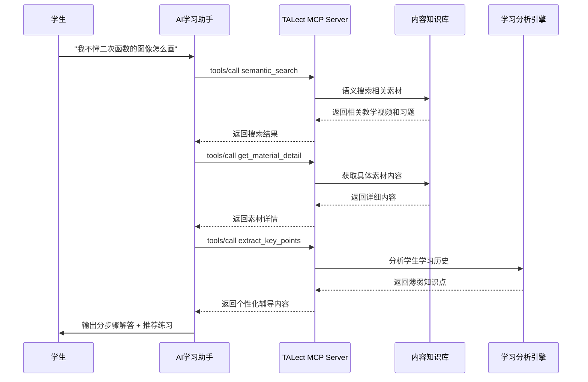

# 个性化学习与智能辅导应用场景

## 🎯 场景概述

学生在学习终端（如学习机、平板、手机App）中通过自然语言提问，AI提供分步骤引导式解答、概念解释，并推荐针对性的练习内容。

## 📋 具体应用方式

### 典型使用场景
- **概念解释**: "什么是质数？能举例说明吗？"
- **解题辅导**: "这道题为什么选C？"
- **知识拓展**: "除了加法，还有哪些运算？"
- **错题订正**: "我经常搞混这两种题型，怎么办？"

## 🛠️ TALect MCP技术实现

### 核心工具调用流程



### 关键API调用

#### 1. 语义搜索理解
```json
{
  "method": "tools/call",
  "params": {
    "name": "semantic_search",
    "arguments": {
      "query": "二次函数图像绘制方法",
      "subject": "math",
      "grade": "grade_3",
      "similarity_threshold": 0.7,
      "limit": 5
    }
  }
}
```

#### 2. 知识点提取
```json
{
  "method": "tools/call",
  "params": {
    "name": "extract_key_points",
    "arguments": {
      "material_id": "material-uuid",
      "count": 5,
      "focus_area": "problem_solving"
    }
  }
}
```

#### 3. 个性化推荐
```json
{
  "method": "tools/call",
  "params": {
    "name": "get_recommended_materials",
    "arguments": {
      "user_id": "student-123",
      "learning_goals": ["掌握二次函数", "提高解题能力"],
      "history_records": ["已学一次函数", "弱于几何证明"],
      "current_topic": "二次函数图像",
      "limit": 3
    }
  }
}
```

#### 4. 难度分析
```json
{
  "method": "tools/call",
  "params": {
    "name": "analyze_material_difficulty",
    "arguments": {
      "material_id": "material-uuid",
      "student_profile": {
        "grade": "grade_3",
        "math_level": "intermediate",
        "weak_topics": ["几何证明", "函数变换"]
      }
    }
  }
}
```

## 📊 预期效果与价值

### 学习效果提升
- **理解深度**: 概念解释更准确、易懂
- **记忆持久**: 分步骤引导帮助知识内化
- **自信心建立**: 及时反馈和鼓励机制

### 规模化因材施教
- **千人千面**: 基于大数据的个性化推荐
- **实时调整**: 根据学习表现动态调整难度
- **薄弱环节突破**: 智能识别和重点辅导

### 学习体验优化
- **随时随地**: 移动端随时提问
- **自然交互**: 对话式学习体验
- **趣味性**: 游戏化学习元素

## 🔧 技术实现要点

### 1. 智能问答引擎
- **语义理解**: 基于向量搜索的自然语言理解
- **上下文关联**: 保持对话连续性和学习路径
- **多模态支持**: 文本、图片、视频等多种输入形式

### 2. 个性化算法
- **学习画像**: 基于行为数据的学生能力建模
- **动态评估**: 实时更新学习状态和知识掌握度
- **路径规划**: AI驱动的学习路径智能规划

### 3. 内容适配引擎
- **难度调节**: 基于学生水平的智能难度调整
- **风格适应**: 匹配学生的学习偏好和认知风格
- **文化适配**: 考虑地域和文化差异的内容选择

### 4. 反馈闭环机制
- **学习追踪**: 详细的学习行为记录和分析
- **效果评估**: 多维度学习效果量化评估
- **持续优化**: 基于反馈数据的系统优化

## 🎯 实施建议

### 第一阶段：基础问答
1. 实现核心概念的问答功能
2. 支持基础的解题辅导
3. 建立学习数据收集机制

### 第二阶段：个性化增强
1. 加入学习历史分析
2. 实现个性化推荐算法
3. 支持多学科知识关联

### 第三阶段：智慧学习生态
1. 集成硬件设备数据
2. 支持家长监护功能
3. 构建学习社区和竞赛

## 📈 成功指标

- **用户活跃度**: 日均使用时长超过30分钟
- **学习效果**: 学生成绩提升10-15%
- **用户满意度**: 家长满意度超过90%
- **功能覆盖**: 支持95%的常见学习问题
- **响应速度**: 平均响应时间小于2秒
